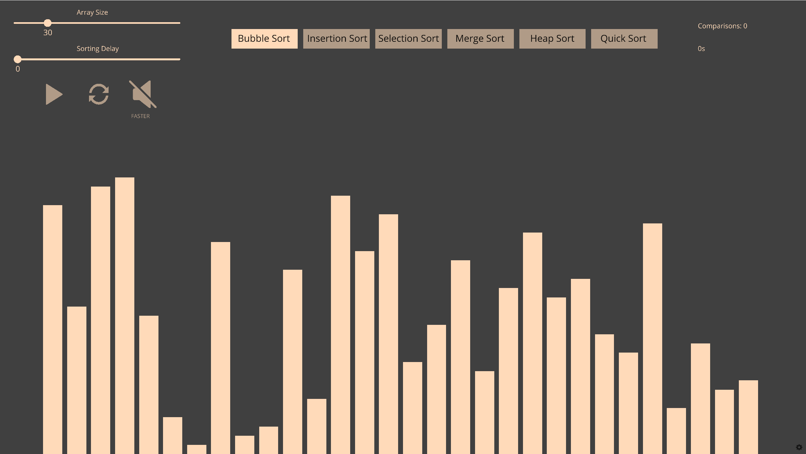

# Sorting algorithm visualizer

**Installation:** 
There are two ways to run the program:
- Download ursina and numpy as mentioned in requirements.txt. Then, download/clone the source code and run main.py
- Download a release; this will be a bit slower though

**Demo:** to be added later

**GUI:**

**Important note: Having sounds enabled will slow the sorting process down to about ~25%.**

**Available algorithms:**
- Bubble sort
- Insertion sort
- Selection sort
- Merge sort
- Heap sort
- Quick sort

